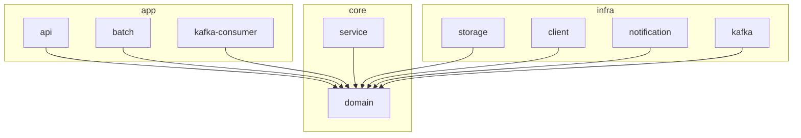

# 프로젝트 모듈 구조

이 프로젝트는 **Spring MVC 기반의 전통적인 레이어드 아키텍처**를 따르면서,  
**포트-어댑터(헥사고날) 아키텍처의 의존성 역전 원칙**을 도입하여 설계되었습니다.

이를 통해 **파악이 빠른 구조와 기술 교체의 유연성**을 동시에 확보하는 것을 목표로 합니다.

## 모듈 구성

```text
- app
  ├── api # REST API Application (Spring MVC Controller)
  ├── batch # Spring Batch Application
  └── kafka-consumer # Kafka 이벤트 Consumer Application

- core
  ├── domain # 순수 도메인 모델 + Port 인터페이스
  └── service # 비즈니스 유즈케이스 구현 (Port를 통해 infra 접근)

- infra
  ├── storage # DB 접근 (JPA 기반), Repository Port 구현체
  ├── client # 외부 HTTP 통신 (Feign 등), Client Port 구현체
  ├── kafka # Kafka Producer, EventPublisher Port 구현체
  └── notification # FCM 등 알림 전송, Notification Port 구현체
```

## 의존성 방향



## 설계 철학


### 전통적 Layered 아키텍처 기반

- `Controller → Service → Repository → DB → Service → Controller` 흐름을 따름
- Spring MVC 패턴과 친화적이기 때문에 코드 흐름 파악이 쉬움

### 포트-어댑터 아키텍처 원칙 도입

- 도메인(core)은 외부 기술(infra)을 전혀 모르며, 오직 Port 인터페이스만 의존
- 기술 교체(JPA→MyBatis, Kafka→RabbitMQ 등)가 service 코드 수정 없이 가능
- service 레이어 단위로 트랜잭션, 테스트 범위 관리가 용이


## 장점

| 항목        | 장점                                     |
|-----------|----------------------------------------|
| 의존성 방향    | `infra → core`, `app → core` 단방향으로 안정적 |
| 도메인 순수성   | 외부 기술에 전혀 의존하지 않음                      |
| 변경 영향 최소화 | infra 교체 시 service 코드 영향 없음            |
| 테스트 용이성   | Port 인터페이스 기반 mock 가능                  |
| 협업 친화성    | 전통적인 Layered 구조로 진입장벽 낮음               |


## 유의사항

- `core/service`에서는 반드시 `infra` 구현체에 직접 의존하지 않고, `core/domain`의 Port만 의존해야 합니다.
- `app/*` 모듈에서는 `core/service`의 유즈케이스만 호출하도록 일관성을 유지해야 합니다. (현재는 app 모듈에서 core:service 에 바로 접근하여 비즈니스 로직 호출하고 있음)
- `infra/*` 모듈은 오직 `core/domain`에만 의존해야 하며, `core/service`에는 의존하지 않아야 합니다.


### 용어 정리

- **Port** : 도메인(core)이 외부 기술(infra)과 상호작용하기 위해 정의한 인터페이스
- **Adapter** : Port를 실제 기술(JPA, Kafka 등)로 구현한 것
- **Domain** : 순수 비즈니스 규칙 및 엔티티 모델
- **Service** : 도메인 모델을 조합하여 유즈케이스 구현
